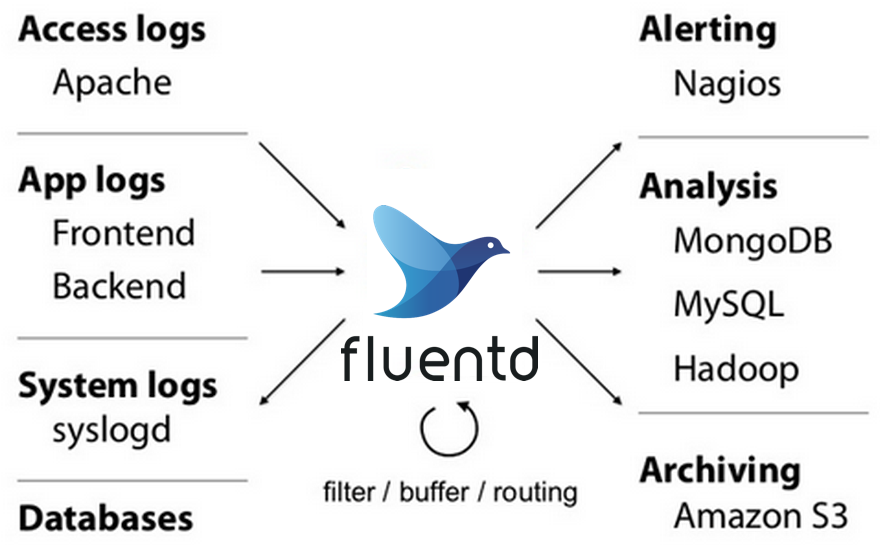

# fluentd-collector
## 1. 전체 컨테이너 구성(워크플로우)

- 로그 보낼 서버(파이썬, 스프링, 아파치 등등) → fluentd → aggregator(선택사항) → elasticsearch → kibana



### 레포지토리 내용
```
├─app ## 파일로그와 컨테이너 로그 수집을 위한 테스트 파일
├─assets
├─docker
|   ├─docker-compose-ag-container.yml ## aggregator 사용 시 컨테이너 로그 수집
|   ├─docker-compose-ag-file.yml  ## aggregator 사용 시 파일 로그 수집
|   ├─docker-compose-container.yml ## 컨테이너 로그 수집
|   └─docker-compose-file.yml ## 파일 로그 수집
└─fluentd
    ├─aggregator ## aggregator 사용
    │  ├─container
    │  └─file
    └─conf ## 그냥
        ├─container
        └─file
```
## 2. Fluentd로 파일 로그 수집
### 2-1. 바로 Elastic이나 Opensearch로 보낼 시
```
## 로그 파일 전달
<source>
  @type tail
  path /app/logs/*
  pos_file /fluentd/log/app.pos
  tag test1_app_file_log
  read_from_head false
  <parse>
    @type none
  </parse>
</source>

<match test1_app_file_log>
  @type opensearch
  host <opensearch ip 주소>
  port 9200
  user YOUR_USERNAME
  password YOUR_PASSWORD
  ssl_verify false
  scheme https
  include_tag_key true
  flush_interval 1s
  logstash_format true
  logstash_prefix python_app_logs
  logstash_dateformat %Y%m%d
  tag_key @log_name
  <buffer>
    flush_interval 1s
  </buffer>
</match>
```

### 2-2.aggregator을 통해서 전달시
```
## 컨테이너 로그 전달
<source>
  @type forward
  port 24224
  bind 0.0.0.0
  tag test_container_log ## 태그명은 마음대로 지정
</source>

## 컨테이너 로그 처리
<match test_container_log>
  @type copy
  <store>
    @type forward
    <server>
      name log_aggregator
      host Aggregator의 IP 주소
      port Aggregator의 Port
    </server>
    <buffer>
      @type file
      path /var/log/fluentd/container_buffer
      total_limit_size 2G
      flush_interval 5s
      retry_type exponential_backoff
      retry_wait 1s
      retry_max_interval 60s
      retry_forever true
    </buffer>
  </store>
  <store>
    @type stdout
  </store>
</match>
```

## 3. Fluentd로 컨테이너 로그 수집
### 3-1. 바로 Elastic이나 Opensearch로 보낼 시..
```
<source>
  @type forward
  port 24224
  bind 0.0.0.0
</source>

<match *.**>
  @type opensearch
  host <opensearch ip 주소>
  port 9200
  user YOUR_USERNAME
  password YOUR_PASSWORD
  ssl_verify false
  scheme https
  include_tag_key true
  flush_interval 1s
  logstash_format true
  logstash_prefix gitlab
  logstash_dateformat %Y%m%d
  tag_key @log_name
  <buffer>
    flush_interval 1s
  </buffer>
```
### 3-2. aggregator을 통해서 전달 시
```
## 로그 파일 전달
<source>
  @type tail
  path /app/logs/*
  pos_file /fluentd/log/app.pos
  tag test1_file_log ## 태그명은 마음대로 지정
  read_from_head false 
  <parse>
    @type none
  </parse>
</source>

## 컨테이너 로그 처리
<match test1_file_log>
  @type copy
  <store>
    @type forward
    <server>
      name log_aggregator
      host Aggregator의 IP 주소
      port Aggregator의 Port
    </server>
    <buffer>
      @type file
      path /var/log/fluentd/container_buffer
      total_limit_size 2G
      flush_interval 5s
      retry_type exponential_backoff
      retry_wait 1s
      retry_max_interval 60s
      retry_forever true
    </buffer>
  </store>
  <store>
    @type stdout
  </store>
</match>
```
# 구현 화면


